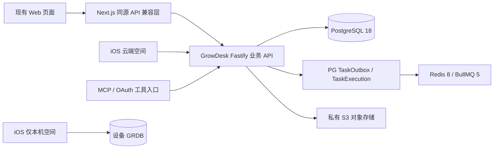

# 09 — 现有 Web 与 iOS 共用 GrowDesk 后端：Gemini 执行计划

日期：2026-09-12。状态：执行规格，**不代表功能已完成或现有 Web 已切换**。
目标：保留旧 Web 的页面和操作习惯；Web、iOS 云端空间、MCP 通过同一业务 API 使用 PostgreSQL 中的同一份数据。iOS 仅本机空间继续独立保存，不因登录而上传。

## 1. 当前事实和边界

本文件编写时的本地核对基线：

| 项目 | 当前状态 | 执行时的处理 |
|---|---|---|
| Web | `baby_panel_for_cecilia`，HEAD `ed7318dd49af0e17c8040ff79e714b9d4859d853`；`lib/prisma.ts` 使用 PrismaLibSql，schema provider=sqlite | 不修改 DATABASE_URL 就尝试接 PostgreSQL；先盘点所有运行入口 |
| 新服务 | `growdesk-server`，身份迁移提交 `e00cedcca786ec9a618053353750504b56b68607`；API 当前只注册 health/live、health/ready | 已有数据库不等于已有登录、业务或同步 API |
| 原生端 | `growdesk-ios`，HEAD `96aa0007bc44874419471a0dd5c7e07c8b317aa1`；本地资料库和备份实现已有，云端客户端尚未接通 | 不重新实现本地库；补契约客户端、账号和 opt-in 绑定 |
| 230 主机 | 先前部署证据：API 回环3180，sing-box nginx HTTPS8443；旧 Web3088保留 | 当前计划未重新访问服务器；部署前重新核验归属、端口、证书和进程 |
| 已迁移身份 | 最近一次验收文件记载：5用户、1家庭、1宝宝、5 FamilyMember、5 BabyMember，密码哈希保留 | 以 `evidence/tasks/LEGACY_IMPORT/target-verification.json` 为历史证据，任务开始时重新核对 |
| 历史资料 | 1,311行保存在 `legacy_import` 私有档案，29附件已复制到私有目录 | 不是正式照护业务表，也不是已完成对象存储迁移；API无权读取档案 |
| 实际写权威 | 旧 Web 仍写旧 SQLite | 新库中的快照不是持续同步；切换前必须再次处理新增、修改、删除 |

编写时已有未提交内容：服务端 `deploy/Migration.Dockerfile`、迁移验收文件、iOS备份转换器；iOS的 `project.pbxproj` 与 `docs/design-mockups/`。必须先记录当前 diff、确认内容归属，禁止 reset/clean、全量 add 或把未验证内容打包到任务提交。

上次中断留下的转换器是另一项工作。不得把“存在 ios_backup.py”写成已经生成、导入并通过 iOS 验收。

## 2. 固定技术路线



- Web继续使用现有 Next.js；不重做 UI，不新建另一个前端框架。
- 入口复用 sing-box 的现有 nginx；05中旧Caddy字样在本部署映射为nginx，TLS、SSE和观测门槛不变。
- 服务端沿用已锁定的 Node24、TypeScript、Fastify5、TypeBox、Prisma7/adapter-pg、PG18、Redis8/BullMQ5。具体 patch/digest 以 lockfile 与部署清单为准，不能由各任务自行升级。
- 对象存储沿用总计划的私有 S3 协议；供应商/桶/区域在对象存储任务中根据已有配置确定并记录，不在不同客户端各写一套存储协议。依赖尚未配置时，用隔离兼容实现跑测试，不能把本地目录宣称为正式 S3。
- **只有新服务端拥有业务数据库访问权**。Next BFF持有面向新API的会话凭据，不持有PG账号；Swift客户端不持有数据库凭据。
- 身份、宝宝权限、写事务、版本、change feed、任务与附件归属由新服务统一处理。禁止在Web BFF重新写一份权限/业务规则。
- 旧Web请求格式由薄兼容层转换；新API契约只有 `packages/contracts/src` 一份权威。兼容层不把失败改成200，也不静默丢掉旧字段。
- 故障时显示错误、保留可恢复请求状态；**不回退写 SQLite**，不建立长期双写或双向数据库复制。

规范优先级：用户最新明确要求 → 本文明确说明的执行顺序补充 → 08账号宝宝关系、07本机/云绑定 → 02接口事务协议、03迁移规则、05性能部署、06任务门禁。本文不降低任何事务、隐私、权限或验收要求。发现无法同时满足的协议，记录具体冲突，先修订权威契约，不能在兼容层自行猜测。

## 3. 仓库和目录职责

| 工作 | 仓库 | 主要入口/建议新增位置 |
|---|---|---|
| 契约、身份、CRUD、同步、任务 | `growdesk-server` | `packages/contracts/src`、`packages/domain/src`、`packages/database/src`、`apps/api/src`、`apps/worker/src`、`apps/scheduler/src` |
| 正式PG迁移、旧数据转换 | `growdesk-server` | `prisma/`、`scripts/legacy-import/`、新建 `scripts/migration/`；已有初始迁移不得改写 |
| Web适配 | `baby_panel_for_cecilia` | 现有 `app/api/**/route.ts`、服务端数据调用；建议 `lib/growdesk/{client,session,compat}/` |
| 原生账号与同步 | `growdesk-ios` | `Contracts/`、既有账号/本地存储边界和网络层；目录先核对实际工程再定 |
| 任务证据 | 实际修改的仓库 | `evidence/tasks/<任务ID>/REPORT.md`，跨库任务逐库记录commit |

建议新增路径不是现存能力。不得为凑齐路径复制整个旧项目；新服务运行和CI不依赖旁边旧仓库。业务逻辑移植保留必要出处、golden测试与静态资料版本。

旧Web写代码前读取其 AGENTS，以及安装版本 `node_modules/next/dist/docs/` 中相关 Route Handler、cookies、server components、缓存与流式响应说明；包缺失先按lockfile安装，不能凭旧版Next经验修改。

## 4. 任务顺序和协作方式

大任务先拆可独立review的小卡：SH-02A模型/迁移、02B UnitOfWork/receipt；SH-03A登录/设备、03B刷新/撤销、03C家庭/宝宝权限、03D密码/恢复；SH-07A任务基础、07B持久AI/SSE、07C各provider/工具、07D通知调度；SH-11A typed mapper、11B promotion、11C增量reconcile、11D附件对账。每张小卡继承父任务约束，并在报告写明准确前置；不能只完成一张就勾选整个父任务。

每个任务遵循：读取输入 → 写验收用例/字段表 → 实现 → 隔离验证 → 写报告 → **单独提交** → 独立review。报告只能自标 `IMPLEMENTED_NOT_REVIEWED`；review通过后才 `ACCEPTED`。不要让一个Gemini任务承担整个项目。

| 阶段 | 子任务 | 与旧计划的关系 | 可并行范围 | 阶段退出条件 |
|---|---|---|---|---|
| A盘点 | SH-00、SH-01 | BOOT-02验收、BE-01 | Web入口盘点可与契约审查并行 | 基线、所有调用/写入口、字段矩阵、契约生成校验可用 |
| B账号底座 | SH-02、SH-03 | BE-02/03/04 | Web兼容类型可先写，不能伪造登录 | PG约束、真实登录、逐宝宝授权可验收 |
| C一条完整链路 | SH-04F、SH-05 | BE-05 feeding、BE-12准备 | BFF会话与feeding handler可在契约冻结后分工 | 新测试环境Web可登录并完成喂养增改删恢复及冲突处理 |
| D领域齐备 | SH-04D/S/FO/N/G、SH-06、SH-07、SH-08 | BE-05/07/08A/08B/09/10/11 | 一人独占schema/公共事务框架，其他人分领域 | 所有仍在用的Web/MCP/后台功能都有新端点与证据 |
| E跨端共享 | SH-09、SH-10 | BE-06、IOS01/02/04及07修订 | 后端同步与iOS实现按固定契约分工 | 同一测试数据双端可见、离线补传/撤权/关闭同步正确 |
| F数据与运维 | SH-11、SH-12 | DB迁移、OPS | ETL开发可提前，正式演练需模型稳定 | 数据全量+增量演练、附件、权限和性能验收通过 |
| G正式切换 | SH-13 | BE-12生产切换 | 单一发布负责人串行操作 | 单写权威切换、真实读验证、可执行回滚/前向恢复方案 |

**顺序补充**：原BE-12放在BE-10/11之后。现在允许提前实现兼容层、一个领域和隔离Web预览，以便尽早发现兼容问题；原有完整迁移/正式切换门禁仍在最后。开发拆分不等于允许缺功能切换生产。

## 5. 任务卡：SH-00 基线和完整调用清单

**输入**：三个仓库AGENTS、START_HERE、02/03/04/06/07/08、本文件、已有迁移报告。

**步骤**：
1. 逐仓库记录分支、HEAD、dirty文件；当前部署只记证据来源，不把本地HEAD写成线上版本。
2. 核对现有 `backend:*` 命令：若仍调用 `scripts/not-ready.mjs`，明确标记占位。先补BOOT-02剩余证据，不重新搭脚手架。
3. Web生成 `web-call-inventory.csv`：每个HTTP method+path、实际调用页面/后台程序、输入输出、鉴权、读写表、外部副作用、目标operationId、状态、测试文件。
4. 搜索不止 `app/api`：`lib/auth.ts`、`lib/api-helpers.ts`、server component/action、`lib/agent`、MCP/OAuth、日报、通知、stdio、systemd/cron脚本和管理命令都要登记。
5. 逐旧字段标注：原样保留/显式转换/新的服务端计算/敏感禁止输出/待人工判断。每个未映射字段必须有处理说明，不得默认为“客户端不用”。

**验收**：路由和数据库调用搜索结果都有归属；不知道是否生产可达的入口不能从清单删除。输出 `evidence/tasks/SH-00/REPORT.md`，含所有现存缺口。该任务不修改业务或生产配置。

### 5.1 已核对的扫描起点（不是完整覆盖声明）

当前Web的 `app/` 下扫描到73个 `route.ts`、118个通过 `export function` 声明的HTTP方法；此统计不含const别名等其他声明形式，SH-00须补全。简单Prisma/SQLite引用搜索命中60个非测试文件；它包含迁移/维护脚本，不能直接等同60个生产写入口。

优先沿以下路径追踪调用：

- `app/api/auth/**`、`app/api/family/**`、`app/api/baby/**`、`lib/auth.ts`、`lib/api-helpers.ts`。
- `app/api/records/**`、`app/api/food/**`、`app/api/nutrition/**`、`app/api/growth/**`、`app/api/medical/**`、`app/api/vaccines/**`。
- `app/api/ai/**`、`app/api/agent/**`、`lib/agent/**`、`lib/ai-daily-summary.ts`。
- `app/api/mcp/route.ts`、`lib/oauth/**`、`scripts/mcp-server.mjs`以及OAuth well-known/授权路由。
- `app/api/push/**`、`app/api/notifications/route.ts`、`scripts/prune-ai-archive.sh`、backup/restore/switch脚本及其部署调用方。

每个method分别登记；同一路径GET已经迁移而POST仍直写旧库，是未完成状态。后台配置是否实际启用需有证据，不能从脚本存在推断运行中。

## 6. 任务卡：SH-01 契约和 Web 兼容矩阵

**依赖**：SH-00；与BE-01对齐。

1. 在权威 TypeBox schema注册实际端点；导出 OpenAPI3.0.3。旧接口映射例：`/api/baby` → `/api/v1/families/:id/babies`或`/api/v1/babies/:id`，`/api/records/feeding` → 宝宝scope记录端点。最终method/path以02为准，不能在本文另造协议。
2. 建立 `docs/compat/web-api-mapping.md`，每一行细化method、query/body、返回envelope、日期/小数/空值、错误码、上传/SSE、目标operationId、mutationId/entityId/baseVersion来源。
3. `Date`/`Decimal`/`BigInt`经DTO转换；decimal和version/cursor用字符串，日期不转换成UTC午夜；旧JSON字符串仅在兼容边界显式解析。
4. 建立脱敏golden fixtures，敏感数据用test_租户替代。测试空/缺省/null、未知enum、400/401/404/409/410/422/429/503、超大cursor、多宝宝。
5. 修复真正的契约生成/检查命令；生成文件与源不一致时CI失败。iOS按提交+SHA256消费固定快照。

**验收**：生成无diff，operationId唯一，Swift解析/编译样例通过；未实现端点有状态标记，不能注册返回假成功的路由冒充完成。

## 7. 任务卡：SH-02 正式数据模型和统一事务基础

**依赖**：SH-01；与BE-02对齐。**schema目录只允许一个实施者持有写权限。**

1. 先review已部署 `202609120001_identity`，记录User/Family/FamilyMember/Baby/BabyMember/sync states的真实字段与约束。差异通过**新迁移**修复，不编辑已应用SQL或抹除 `_prisma_migrations`。
2. 按02/03补会话、refresh/recovery、幂等receipt、TimelineEntry、FamilyChange/UserChange、绑定/代际、LegacyIdempotencyMapping、必要任务元数据。照护业务模型按后续子任务逐个加入。
3. 固定实体version与scope cursor为不同概念；发现当前基础模型类型与正式协议不一致，先迁移和测试，不能在DTO中用强转掩盖。
4. 建立principal-scoped repository和UnitOfWork。锁顺序按02：UserSyncState排序 → FamilySyncState排序 → DeviceSession → RefreshCredential/RecoveryCode → TaskExecution → 业务实体。取得锁后重验权限。
5. 业务实体、timeline、change、receipt、outbox同事务；不在事务内调用AI、Redis网络或S3。cursor按提交顺序分配，不用独立sequence充当feed安全游标。
6. 权限从所有者迁移账号分离：API无DDL权限；`legacy_import`和密码哈希不进入普通DTO、feed、日志。当前API仍无正式表权限，应随已验收repository添加最小授权，不执行全库GRANT ALL。

**验收**：真实PG18测试复合FK、并发唯一性、事务中途失败、跨家庭关联、账号删除保留共享宝宝、索引查询计划、cursor提交顺序；migration从空库及当前身份基线均能升级。

## 8. 任务卡：SH-03 账号、会话与宝宝授权

**依赖**：SH-02；与BE-03/04对齐。

- 实现02登记的登录/注册/刷新/登出、设备会话、密码修改和恢复码；旧bcrypt哈希可验证，成功后按既定密码方案升级。不能重新生成所有用户密码。
- 新旧JWT不混用；新API严格验证issuer/audience/type/session。已有旧Web cookie在切换后重新登录，清晰提示一次；不复制旧JWT密钥做无条件兼容。
- 实现家庭与宝宝目录、显式选择、邀请与撤权；家长属于家庭不等于拥有每个宝宝权限。后续新增宝宝不会自动开放给全家庭成员。
- 旧短邀请码目前未激活。若按02保留7天兼容，必须走受限digest映射、起止时间与管理员撤销；否则明确要求重新发邀请。不能直接重新暴露旧inviteCode。
- 最后一个有效管理员保护、退出家庭、删除个人数据分别覆盖，不能直接cascade删共享资料。

**验收**：两个家庭、多宝宝、admin/member/viewer、撤权与写入竞态；两个客户端同时refresh、丢响应同rotationId重试、不同rotationId复用撤销；已登出token不可继续读。Web端和iOS使用各自DeviceSession。

## 9. 任务卡：SH-04 按领域交付完整记录链路

每一行是**独立任务和提交**，不能一个提交全部铺开：

| 子任务 | 领域与旧入口 | 特别检查 |
|---|---|---|
| SH-04F | 喂养 `app/api/records/feeding/route.ts` | 奶量/亲喂时长/吐奶、奶粉归属、历史营养快照、source/recordedBy不冒充当前actor |
| SH-04D | 尿布 `app/api/records/diaper/route.ts` | 类型和性状、时间、备注；保留旧枚举含义 |
| SH-04S | 睡眠 `app/api/records/sleep/route.ts` | 未结束记录、结束时间、跨午夜、活跃睡眠约束、两设备同时结束 |
| SH-04FO | 辅食 `app/api/food/logs/route.ts`及plans | 食物引用、接受度、异常、date+wall time、JSON结构 |
| SH-04N | 营养 `app/api/nutrition/**` | 产品、补剂、计划、实际用量、单位和历史引用；停用产品不丢旧记录 |
| SH-04G | 成长 `app/api/growth/**` | 体重/身高/头围的小数、WHO规则、日历日期、图片依赖SH-06 |

SH-04F要同时落地喂养所需的FormulaProduct最小正式模型、家庭归属校验和必要读取，保留后续完整产品管理兼容；不等待SH-04N的营养分析，也不伪造产品或丢弃旧产品ID。

每个子任务：模型/新migration → 领域service → scoped repository → API/schema → compatibility mapper → golden与事务测试。必须完成create/read/update/delete/restore和列表，不只完成新增。

**统一验收**：同mutationId同内容重试不重复；同键不同内容409；同baseVersion并发仅一方成功；跨宝宝读取/编辑拒绝；回滚时所有投影均不留下半条；分页稳定；Web→新API→PG再读内容与旧合同匹配。409显示冲突并允许重新选择，不能悄悄覆盖。

## 10. 任务卡：SH-05 Web BFF 和第一条联调链路

**依赖**：SH-01/02/03和SH-04F。允许在独立测试实例提前做；不切旧生产。

1. 在Web新增唯一 `server-only` GrowDesk客户端，固定配置的API origin、明确超时/流式策略、标准错误转换。用户输入不能决定上游host，不能把incoming URL直接拼成任意代理。
2. 浏览器访问同源Next路由。采用随机不透明会话cookie，`HttpOnly + Secure + SameSite=Lax`；浏览器不获取refresh token，不放localStorage。BFF会话映射保存于新服务端受控的持久会话存储，通过内部接口管理；短期凭据加密保存，BFF不增加数据库直连或仅内存session。
3. 如现有02会话契约不足以承载BFF token托管，先以SH-01补充内部BFF会话契约和受信BFF服务身份，限定可取会话凭据的权限；不得暴露给普通App token，不能以固定万能userId代理所有用户。cookie中的随机secret在数据库只存摘要。
4. 刷新必须按会话跨进程串行，并复用持久rotationId。只用Node内存mutex不能解决多Web实例竞争；验证上游刷新已成功但BFF保存结果前崩溃的恢复。同一次请求最多刷新/重试一次，写请求保持原幂等键。
5. cookie认证的修改请求检查Origin/CSRF；同时保护登录，不能只依赖CORS或SameSite。代理清理客户端传入的内部身份头，仅转发白名单header，不接收伪造actor/userId。
6. 兼容旧路由和页面；移除这些路由实际可达的旧Prisma调用。需要用户选择宝宝时，使用有权限的显式选择结果，不在BFF里findFirst。
7. 补Web请求层稳定mutationId/entityId/baseVersion。BFF不能每次重试生成新键，也不能为旧更新请求自动取最新version后强制覆盖；页面初次读取要保留版本。
8. 用户专属响应 `no-store`；检查SSR/server component缓存和request memoization不跨用户。多标签退出、切宝宝、撤权时更新缓存。

**验收**：隔离Web页面实际登录→选择宝宝→新增/编辑/删除/恢复喂养；另一浏览器读取同数据；CSRF攻击失败；并发刷新不误踢登录；BFF重启会话恢复或明确重新登录；503不会写回旧SQLite。路径兼容不等于测试只mock HTTP成功。

**BFF协议必须在SH-01写进权威契约后实施**：

- cookie采用256bit随机secret，命名 `__Host-growdesk_web`，设置Path=/，不设Domain；数据库仅存摘要。idle/absolute过期对齐DeviceSession；登录和权限敏感变更轮换cookie，退出/撤销清理映射与缓存。切换清除旧cookie，不把旧JWT兑换为受信新会话。
- cookie认证的修改请求包含登录、注册、刷新、登出，都要求配置中的canonical Origin和CSRF token；缺失或不匹配拒绝。匿名登录表单先获取CSRF挑战。不能以请求Host/X-Forwarded-Host推导允许origin；Bearer-only API/MCP走独立鉴权路径。
- 不原样转发Cookie、Authorization、X-User-ID或内部身份头。从验证后的BFF会话产生上游认证；route/method/header均有白名单，保留requestId/幂等键；CORS禁止wildcard配合credentials。
- 跨实例刷新由新后端的受控会话锁/lease协调，不要求BFF直连PG。锁内重读access有效期和rotation状态；调用前持久化rotationId，成功后原子保存加密successor和映射。结果未知时重试同rotationId，遵守02的60秒重放窗口。
- 验收必须包含：旧cookie拒绝、缺Origin/恶意Origin/缺CSRF、两个BFF实例加两个标签并发刷新、上游成功但映射保存前崩溃、撤权和切账号后的缓存/旧请求。浏览器始终不持有API access/refresh token。

## 11. 任务卡：SH-06 附件、报告和疫苗

**依赖**：SH-02/03，任务基础按需要接SH-07；对应BE-07及部分BE-10。

- 私有S3接入、上传init/complete、实际size/MIME/hash检查、受保护下载、删除引用和孤儿清理。
- 迁移avatar、growth、medical、nutrition及归档文件；建立源路径/原行归属/对象key/hash/处理状态清单。`AiArchive`无可靠所有者时隔离，不能按“在同一个数据库”开放给全家庭。
- 所有旧图片URL通过有鉴权映射处理；新Web部署不能继续静态公开医疗上传目录。复制了文件不等于完成迁移。
- 补医疗报告、检验项目、OCR草稿确认、疫苗计划/实种/选择；区分疫苗数据库ID和稳定业务ID。OCR网络任务依赖SH-07，不把识别结果自动当确认记录。

**验收**：本人可读、他人/撤权后拒绝；越权旧URL也拒绝；超大或伪MIME拒绝；可见附件逐件hash匹配；报告/疫苗旧字段无静默遗漏；大文件流式内存有界。

## 12. 任务卡：SH-07 后台任务、AI 和通知统一

按BE-08A → 08B → 09拆分，不合成一个大任务：

1. 持久TaskExecution/TaskOutbox、dispatcher、worker lease/fencing、Redis丢失重建和重复投递。
2. AI run、持久event、SSE重连/Last-Event-ID、取消/重试；API进程退出、浏览器关闭或App切后台不丢任务。
3. 旧AI读写工具全部委托统一service；记录写入需确认计划与稳定动作幂等键。日报、语音、OCR、营养识别、usage预算逐项移植。
4. Web BFF流式透传和断开处理不得取消已经持久化的AI run；nginx按AI协议配置buffering、超时，不能给所有普通请求无限timeout。
5. 日报/通知/归档清理旧scheduler与新scheduler必须有切换清单和唯一运行权威。先用fake provider和test_收件人验证，真实外部调用单独受限验收。

**验收**：Redis重启、worker重复领取、进程崩溃、旧fence结果拒绝、慢SSE客户端、重复确认不重记、不重复推送；故障不能伪造AI答案。历史AiJob只作历史，不重入待执行队列。

## 13. 任务卡：SH-08 Web剩余功能和MCP清零

**依赖**：相关领域任务、SH-07；对应BE-10/11和BE-12准备。

- 按04功能矩阵补疫苗、发育、食材、绘本、活动、天气、参考发布版本、账户设置、导出/删除、连接/PAT、语音历史、已读状态等；有些能力没有独立页面也必须登记。
- OAuth/MCP发现、授权、PKCE S256、单次code兑换、严格aud/scope、撤销、归因保留；旧OAuth/PAT/Push本次未激活，按逐客户端兼容和重新授权清单处理，不能声称已透明继承。
- MCP HTTP、stdio、代理工具、自动任务和维护命令不再绕过API直接操作旧数据库。纯离线迁移/隔离测试脚本可保留，但不属于生产可达入口。
- 建立架构门禁：沿运行入口扫描 `@/lib/prisma`、generated client、LibSQL、sqlite驱动、raw SQL、动态import、旧DB环境变量与后台命令；明确允许列表仅限迁移和测试。
- Web生产环境移除旧数据库连接凭据；旧文件即使可读也不作为回退数据源。

**验收**：SH-00清单每行有新服务归属和测试；没有漏掉的生产可达DB调用；旧Web全部关键Playwright流程在独立PG新后端通过；MCP授权/调用可独立验证，不能仅靠Web测试代替。

## 14. 任务卡：SH-09 后端同步协议

**依赖**：SH-02/03/相关记录、SH-06/07任务基础；对应BE-06。

- FamilyChange/UserChange、有界highWater分页、签名cursor绑定账号/家庭/权限版本；过滤在数据库查询内完成。
- 一致性bootstrap快照、对象下载校验、tail追赶、retention/410/epoch恢复。冻结highWater不是按updatedAt捞所有行。
- CloudSyncBinding包含pending/active/paused/revoked、generation；首次导入使用批准计划+importId/chunkId，不能借普通active sync绕过授权。
- 存量导入建立可证明的baseline epoch/cursor和timeline；不制造不存在的客户端mutation receipts。

**验收**：快照期间并发写不丢、不重复；撤权后旧cursor失效且不泄露宝宝元数据；跨账号/家庭复用cursor拒绝；超页限/大库有界；重启可恢复pending import。

## 15. 任务卡：SH-10 iOS接入共享数据

**依赖**：SH-01/03/09；只在 `growdesk-ios` 实施并单独提交。

1. 固定OpenAPI快照与source.json，生成客户端。补账号登录、Keychain会话、actor串行刷新。
2. 登录后明确列出云端家庭和可访问宝宝；当前纯本机vault不自动改归属。用户可选择现有云端宝宝，不因导入时保留同一ID而重新创建宝宝。
3. 选择“使用已有云端资料”时下载到独立binding空间；选择“上传本机资料”时先显示范围/目标/冲突预览，再批准pending导入。旧试用备份中同ID记录与云端已存记录走冲突/映射，不盲目覆盖或重复创建。
4. 同步引擎处理mutation queue、receipt、版本冲突、暂停/重开、撤权、切账号及迟到响应。保留原有本地CRUD/附件/备份能力。
5. Web修改后iOS能拉取；iOS上传后Web可读。展示实际同步状态，不显示尚未实现的“已同步”。

**验收**：iOS/Web交叉增改删恢复与冲突；飞行模式编辑→重启→恢复联网不重记；用户选仅本机保存时即使登录联网也没有业务上传；关闭同步不删除云副本；撤权不转存云数据到私人vault；同时查看不同宝宝不串号。

## 16. 任务卡：SH-11 正式ETL和增量对账

**依赖**：相关正式模型及附件协议稳定；不能把 `legacy_import` 作为Web在线查询来源。

先登记当前导入的snapshot时间/hash和batchId，明确它是“源仍可写的历史身份基线”。逐字段比较目标身份与该基线，检查基线后的身份/业务修改；没有审计ledger时不能凭空声称“目标新增commit=0”。后续预览建立可审计写记录及禁止真实租户试写的控制，发现差异先形成冲突计划。

1. 保留当前私有快照/原始行hash及source IDs，逐模型建立typed mapper；static reference、identity、家庭配置、记录、私有聊天/任务历史、附件按依赖顺序导入。
2. 对date/instant/Decimal/JSON/软引用/历史产品和作者逐项转换。非法或不确定行进入可追踪quarantine，记录原因和处理决定；最终切换不得把未解决行静默排除后宣称完整。
3. 给 `legacy_import` 历史行建立promotion receipt：源系统+表+ID+源hash+映射版本+目标ID/hash/结果。保存原始正文不意味着正式业务字段已转换。
4. **当前 importer 不能用于最终增量**：`import_sql.py` 明确只允许空身份库或同批重试。实现新reconcile流程，按稳定来源键比较hash，识别新增、更新、删除；不能移除“非空拒绝”保护后强行upsert。
5. 旧表部分没有可靠updatedAt/tombstone，因此最终差异从完整一致快照的ID集合和内容hash比较，不以时间筛选代替删除检测。
6. 已有目标身份与源冲突必须明确决策：保留原ID；源后续密码/成员/宝宝资料变化按来源基线核对；若目标在试用期间有独立业务写入，停止自动覆盖并输出冲突计划。正式试用写入用隔离test_租户，不能把真实家庭当演示空间。
7. 现阶段源SQLite保持权威。只为迁移读取快照，不写真实记录做测试。对旧源持续写入的情况允许多次离线演练；最终写冻结后再做一次完整差异收敛。
8. 权限回填只有迁移时允许 FamilyMember×Baby 展开；后续家庭成员增加不自动获得全宝宝权限。维护权限版本/epoch，使已下载的过时快照不能绕过撤权。
9. 附件复制与数据库快照不是同一原子事务：最终冻结后核对源引用、文件集合/hash和目标对象；有引用无文件、无法归属或文件变化均列差异。

**验收产物**：逐表源/目标counts、ID集合hash、规范化内容hash、所有FK/软引用/归属检查、timeline与业务表对账、附件hash、quarantine=0或逐项经明确处置、密码验证使用合成账户独立测试而不代用户登录。真实数据证明只输出聚合，不提交PII/密码/令牌/病历或源SQL。

## 17. 任务卡：SH-12 测试、性能和部署演练

**测试层级必须分开记录**：

| 层级 | 必须通过的证据 |
|---|---|
| 静态/契约 | typecheck、lint、架构禁止直连、生成无diff |
| 单元 | 字段映射、日期/单位、权限矩阵、错误转换；不能替代真实事务 |
| 隔离PG/Redis/S3 | 事务、并发、删除与恢复、队列恢复、私有附件及真实SQL计划 |
| Web E2E | 新API新PG上跑现有关键用户流程；不连旧prod.db或3088测试 |
| 跨客户端 | Web与iOS同租户/同宝宝可见性、冲突、撤权；MCP单列 |
| 迁移演练 | 从一致快照导入、重跑、最终差异收敛、完整对账与恢复 |
| 运行验收 | 目标主机健康、TLS、日志脱敏、原有服务前后基线、任务唯一运行 |

执行现有服务端命令：

```sh
npm run backend:typecheck
npm run backend:lint
npm run backend:test:unit
npm run backend:test:integration
```

契约/DB命令仅在SH-01/02替换占位并验收后运行；迁移部署用受控身份 `prisma migrate deploy`，禁止生产 `db push`、`migrate reset`。旧Web的现有API测试仍由其隔离runner管理；新增共享后端E2E runner必须自行创建test_ PG/Redis/S3资源，不能沿用 `DATABASE_URL=file:./prod.db`。新runner的具体命令在任务中实现后写报告，本文不假装已经存在。

性能门槛沿用05，明确分为开发smoke和正式容量验证：

- 正式数据：10,000个test_家庭、2,000合成DAU、总计10,000,000记录，至少一个家庭50,000记录。
- 正式负载：1,000连接（含200 SSE），稳态100 RPS、80%读/20%写，冲击200 RPS。
- 正式阶段：10分钟热身、30分钟稳态、10分钟冲击、2小时浸泡；同镜像/数据manifest跑3次。
- 稳态REST读p95≤250ms/p99≤500ms；写p95≤400ms/p99≤800ms；5xx/timeout≤0.1%；数据库热查询p95≤50ms/p99≤150ms。预期401/409/429单列，重试不得掩盖首轮失败。
- 灾难恢复：PG单主机/磁盘故障WAL归档RPO目标≤5分钟、RTO≤60分钟，必须实测恢复；不能把进程重启不丢数据宣传为灾难RPO=0。

当前230基础栈的单API小资源配置不等于05的正式双API容量配置。**正式压测在独立容量环境进行，不能因用了独立数据库就压满230共享主机而影响旧服务。** 缺独立环境时交付脚本和smoke证据，容量验收明确未完成，不在报告里降低门槛。

另外覆盖：Web BFF额外延迟、多人同时写同scope、慢附件下载、SSE长连接和任务积压。索引必须用真实EXPLAIN/BUFFERS证据。

预览环境：新的Web实例与测试PG/Redis/对象存储使用独立项目名、凭据、数据卷和未占用端口；先检查端口，不能复用旧3088或已部署3180。nginx使用独立配置且 `nginx -t` 通过后graceful reload；既有自定义master PID文件曾为空，沿用已经验证的唯一进程识别办法，不能改为全局restart。

## 18. 任务卡：SH-13 正式切换与恢复

**开始条件**：SH-00清单全部生产可达功能完成；Web/iOS/MCP与后台写入口已验收；SH-11/12演练通过；明确维护窗口、发布负责人、冻结清单和恢复选择。本文是计划，不是让Gemini现在改生产路由或停止旧服务的命令。

按顺序执行，不并行切换：

1. 保存各仓库发布commit、镜像digest、DB migration版本、nginx配置摘要、旧服务/容器/定时任务基线。新PG做可恢复备份并演练restore；保留源SQLite一致快照和附件副本。
2. 新Web新API先在独立入口通过上线前检查。两者在正式切换前都不能向真实家庭进行独立试写，否则最终源权威无法简单收敛。
3. 在旧系统启用写冻结：不仅页面，还包括HTTP/stdio MCP、OAuth相关状态写、AI工具确认、worker、定时任务、推送和维护脚本。允许的只读路径列白名单；等待在途写/任务达到明确终态或安全暂停，不能仅隐藏按钮。
4. 确认没有旧写者继续提交，再做最终一致快照及文件核验，运行SH-11差异合并。比对新增/更新/删除、账号成员变更、全部业务和附件。
5. 完成一致性/权限/快照baseline检查后，在同一发布步骤启用新后端写入口、切Web同源路由和MCP等入口；退休旧scheduler和直接DB脚本，仅启用新scheduler。要求重新登录/必要OAuth重新授权。
6. 真实数据只做已授权的读取核对；写验证使用明确的test_租户，不往真实宝宝造记录。检查Web/iOS/MCP一致性、同步延迟、任务数量、原站点状态。
7. 保留旧库只读备份和新库定期备份；撤掉旧生产运行的写配置，确认无人会继续写旧SQLite。

**恢复分界**：

写冻结须记录marker、时间和每个writer状态，并证明marker之后没有新源写入才开始最终快照。只有目标身份/业务、删除集合、关联和附件均完成最终对账后才允许开放新写入。

- 新系统尚未接受真实业务写：可以撤回新入口、恢复旧入口和旧任务，验证后解除旧写冻结；新库未完成数据只回滚本次批次，不删不相关资源。
- 新系统已经接受真实业务写：**不能直接切回旧SQLite**，会丢失新写入。首选回滚应用版本并继续使用同一PG；必须预先验证应用回滚版本与schema兼容。必要时再次冻结所有写入，保全新PG，并执行经演练的反向数据迁移/人工冲突处理后才恢复旧库。没有演练的反向迁移，不承诺“随时一键回滚”。
- 不随应用回滚降级已应用数据库迁移。采用expand/contract和前向修复；禁止删卷、重建真实库、覆盖旧源或清除迁移历史。

观察期按05约定执行，错误率、登录失败、同步落后、队列积压、重复任务和对账差异必须有可操作告警。试运行绿灯不等于负载、备份恢复和真机验收都已完成。

## 19. 每个任务的报告与提交格式

```text
任务：SH-xx（对应原BE/DB/IOS任务）
状态：IMPLEMENTED_NOT_REVIEWED / BLOCKED（写具体缺失信息）
仓库、基线HEAD、提交HEAD：
已有dirty文件及是否触碰：
实现范围 / 明确未实现：
契约与migration版本：
改动文件和字段映射：
执行的命令、退出码、隔离环境证明：
权限/失败/重试/并发/跨端结果：
真实部署或真实数据操作：无 / 具体授权范围及聚合证据
已知缺口、下一任务前置：
独立review：未进行 / review报告链接
```

一次完成一块就提交，不把多个领域、生成产物、无关设计文件混为一个提交。默认不push、不安装全局依赖、不改生产。用户已有明确授权的阶段按其范围执行；遇到缺少密钥、DNS、对象存储等外部输入，列出具体缺口，继续不依赖它的隔离工作，不要求用户重新批准已经授权的普通实现。

## 20. 下一步直接交给 Gemini 的范围

**第一轮只领取 SH-00。** 输出真实基线、完整调用/写入口清单、兼容字段矩阵初稿、占位脚本和现有能力的核对、首条feeding链路的精确依赖。提交报告后交独立review，再领取SH-01。

不能让Gemini从“新库已经有5个用户”推断登录接口完成；不能从“保留了1311行”推断业务数据可查询；不能从“健康检查200”推断旧Web可以换数据库。后续每轮按任务卡依赖领取，避免同时修改schema、契约和客户端造成无法定位的跨库漂移。
